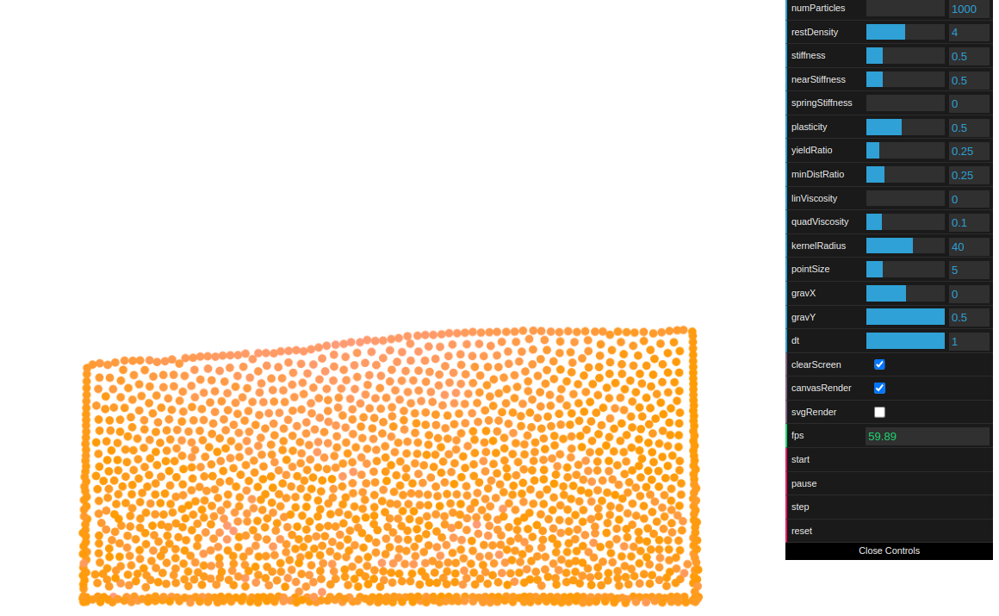
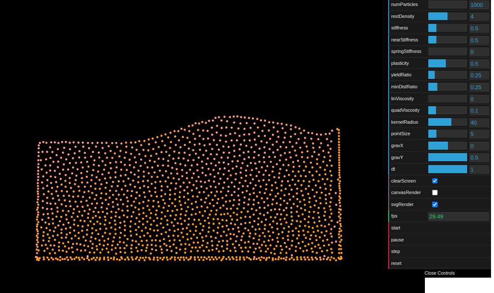

# Particle-based Viscoelastic Fluid Simulation Implementation

This project is an implementation of the paper Particle-based Viscoelastic Fluid Simulation by Simon Clavet, Philippe Beaudoin, and Pierre Poulin.
https://dl.acm.org/doi/10.1145/1073368.1073400

## About:

This repository contains a TypeScript version of the original JavaScript implementation found here.
https://github.com/kotsoft/particle_based_viscoelastic_fluid

Feel free to use this description in your README.md or any other documentation for your repository.
